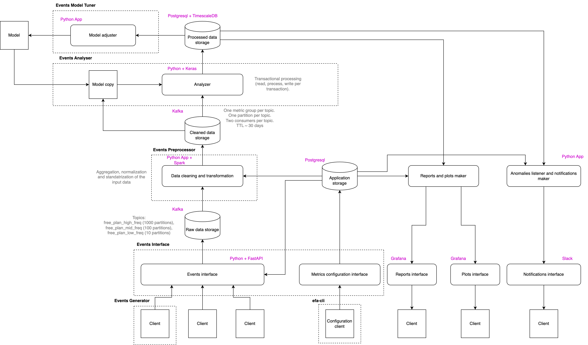

# The Events Flow Analyser

## Overview
The **Events Flow Analyser (EFA)** project is designed for analyzing discrete event streams, visualizing analysis results, and providing real-time notifications about the findings. For example, such a system can be used to detect fraud or anomalous events within an event stream.
Events Flow Analyser can function as an independent service deployable in containers managed by Kubernetes. EFA is capable of receiving and processing data in real time. Its microservice architecture and Clean Architecture design make it easy to replace the underlying infrastructure that EFA interacts with. 

## Architecture
The basic structure of the project is shown in the diagram below.

Links to the main parts of the project:
- [Events Generator](https://github.com/vukolov/events_generator)
- [Events Interface](https://github.com/vukolov/events_gateway)
- [Events Preprocessor](https://github.com/vukolov/events_preprocessor)
- [Events Analyser](https://github.com/vukolov/events_analyser)
- [Events Model Tuner](https://github.com/vukolov/events_model_tuner)
- [Configuration Client](https://github.com/vukolov/efa_cli)
